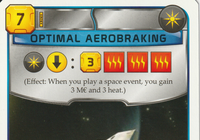
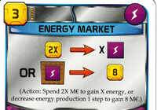
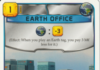
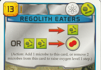
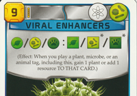
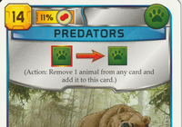

This project is for fans of the superlative 2016 board game *Terraforming
Mars*, and is in no way affiliated with FryxGames AB.

PETS is a specification language for Precisely Expressing Terraforming
Semantics.

<table>
  <tr>
    <td valign="top" nowrap="nowrap">
      <samp><samp><strong>EventCard(HAS SpaceTag): &nbsp;&nbsp;&nbsp;&nbsp;3 MC, 3 Heat</strong></samp></samp>
    </td>
    <td valign="top" nowrap="nowrap">
      <samp><samp><strong>2X MC -&gt; X Energy PROD[Energy] -&gt; 8 MC</strong></samp></samp>
    </td>
    <td valign="top" nowrap="nowrap">
      <samp><samp><strong>PayingFor&lt;Class&lt;EarthTag&gt;&gt;:: &nbsp;&nbsp;&nbsp;&nbsp;-3 Owed</strong></samp></samp>
    </td>
  </tr>
  <tr>
    <td valign="top">
      
    </td>
    <td valign="top">
      
    </td>
    <td valign="top">
      
    </td>
  </tr>
</table>

The game (with its expansions) is overflowing with hundreds of interesting
project and prelude cards, corporations, milestones, awards, maps, standard
projects, colony tiles, political parties, and global events, and no two are
alike. But what exactly makes one different from another? For 99% of all the
officially published content, at least: you can write that down using PETS.

You'll notice that PETS resembles the icon language on the published cards,
which is intentional. It is also a... for lack of a better term, real language,
with a generic type system and stuff like that.

So, why do we want a specification language for Terraforming Mars cards?

From this *single representation*, we can:

* Generate the card's English-language instruction text (mostly works today)
* Generate instructions in other languages too (volunteers welcome)
* Generate the iconographic representation of the card (volunteers welcome)

... and there is also [Solarnet](https://github.com/MartianZoo/solarnet), a
completely working game engine that can basically play any card correctly as
long as it's written in this format.

If everything is single-sourced from the PETS representation, then what a card
does basically can't be different from what it *says* it does, because there
aren't two different representations of that behavior to get out of sync with
each other.

## What's here

This is a Kotlin multiplatform project, so it can be run on a JVM, or as
javascript in a browser, or in yet other ways I haven't verified yet.

*pets* has the parser, the AST library it parses into, the class loader and type system.

*tfm-canon* is the catalog of all officially published Terraforming Mars content.

*tfm-fake* is fake versions of cards/etc. that aren't in canon because they don't really work right.

*pets-almanac* is a web app.

*tools* has random one-off crap.

<table>
  <tr>
    <td valign="top" nowrap="nowrap">
      <samp><samp><strong>-&gt; Microbe&lt;This&gt; 2 Microbe&lt;This&gt; -&gt; OxygenStep</strong></samp></samp>
    </td>
    <td valign="top" nowrap="nowrap">
      <samp><samp><strong>BioTag&lt;@CardFront&gt;: Plant &nbsp;&nbsp;&nbsp;&nbsp;OR Animal&lt;@CardFront&gt; &nbsp;&nbsp;&nbsp;&nbsp;OR Microbe&lt;@CardFront&gt;</strong></samp></samp>
    </td>
    <td valign="top" nowrap="nowrap">
      <samp><samp><strong>Animal&lt;Anyone&gt; -&gt; Animal&lt;This&gt; End: VictoryPoint / Animal&lt;This&gt;</strong></samp></samp>
    </td>
  </tr>
  <tr>
    <td valign="top">
      
    </td>
    <td valign="top">
      
    </td>
    <td valign="top">
      
    </td>
  </tr>
</table>

<table>
  <tr>
    <td valign="top" nowrap="nowrap">
      <samp><samp><strong>This: UseAction&lt;ActionCard( &nbsp;&nbsp;&nbsp;&nbsp;HAS ActionUsedMarker)&gt;</strong></samp></samp>
    </td>
    <td valign="top" nowrap="nowrap">
      <samp><samp><strong>This: PROD[X MC FROM Heat]</strong></samp></samp>
    </td>
    <td valign="top" nowrap="nowrap">
      <samp><samp><strong>This: PROD[1 MC / &nbsp;&nbsp;&nbsp;&nbsp;CardFront(HAS MAX 0 Tag)]</strong></samp></samp>
    </td>
  </tr>
  <tr>
    <td valign="top">
      
    </td>
    <td valign="top">
      
    </td>
    <td valign="top">
      
    </td>
  </tr>
</table>

<table>
  <tr>
    <td valign="top" nowrap="nowrap">
      <samp><samp><strong>CityTile&lt;Anyone, MarsArea&gt;: PROD[1 MC] CityTile: 3 MC</strong></samp></samp>
    </td>
    <td valign="top" nowrap="nowrap">
      <samp><samp><strong>PROD[@StandardResource]: @StandardResource</strong></samp></samp>
    </td>
  </tr>
  <tr>
    <td valign="top">
      
    </td>
    <td valign="top">
      
    </td>
  </tr>
</table>

<!--
Draft for the future standalone PETS repository; module descriptions above are
wording for that repository.

Gallery captions come from the canon cards.json5 definitions. They omit printed
requirements, VP scoring except for Predators, Tharsis Republic's solo setup
clause, and the starting effects of Tharsis Republic and Manutech. Line breaks
and indentation are for display.
Image alt text uses name / top text / bottom text from
english-corrected-wording-evidence.tsv in the english working copy.

The gallery has 11 cards: three opening examples and eight more examples at
the bottom, in three separate tables. The two corporations share the last table.
The first two tables use the upper 50% of Hadronikle's thumbnails, stored under
images/pets-repo-draft.
Nested samp elements give captions an intermediate font size under GitHub
Markdown styling without code-block copy controls.
Sponsored Academies remains a reserved candidate:
This: -ProjectCard THEN 3 ProjectCard, EACH Other@Player(NOT Me@Owner) { ProjectCard<Other@Player> }
-->
